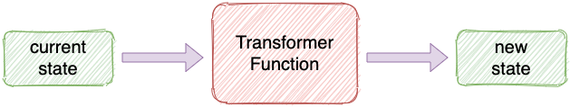

<div align="center">

# [
  
> Simple state management using just JavaScript

[](https://www.npmjs.com/package/nanny-state)
[](#license)

</div>


**NANNY STATE** provides a simple to use declarative API that makes it easy to build interactive user interfaces.

It stores all the app data in a single state object and automatically updates the view whenever the state changes.

NANNY STATE is:

- **FAST AND EASY** - Build interactive user interfaces that render blazingly fast with just a few lines of code.
- **PREDICTABLE** - All the data is stored in one place, making your code more organized, predictable and easier to test.
- **EASY TO LEARN** - There are only a few basic concepts to learn and everything is written in Javascript - there's no new syntax to learn!

Whether you are building a small interactive web page or large complex app, NANNY STATE is a simple and fun alternative to React and Vue! It's quick to get started - just follow the [examples](#usage-examples) below and you'll see some impressive results in just a few lines of code.

## What Is NANNY STATE?

NANNY STATE is comprised of 3 interdependent parts:

* **State** - usually an object that stores all the information about the app
* **View** -  a function that returns a string of HTML based on the current state
* **Transformers** - pure functions that update the state based on events

The state is the single source of truth in the application and stores all the information about the app as data. The state can only be updated by passing transformer functions to Nanny State's `Update` function. This ensures that any changes are deterministic and have predictable outcomes.

## Background

NANNY STATE was inspired by [Redux](https://redux.js.org) and [Hyperapp](https://hyperapp.dev) and uses the [lit-html](https://lit-html.polymer-project.org) library for rendering. 

It also has some similarities with [Elm](https://elm-lang.org), although I'd never used Elm when I first wrote it. It is open source software; please feel free to help out or contribute.

## Data Flow

NANNY STATE uses a one-way data flow model:

<div align="center">
  


</div>

When a user interacts with the page, it triggers an event that uses a transformer function to update the state. The page is then automatically re-rendered to reflect these changes.

## Installation

### Using NPM CLI

Install [nanny-state](https://www.npmjs.com/package/nanny-state) from NPM.

```bash
npm install nanny-state
```

Then import like this:

```javascript
import { Nanny, html } from "nanny-state";
```

### ES Modules

If you use ES Modules, you don't need NPM. You can import from a CDN URL in your browser or on CodePen.

```html
<script type="module">
import { Nanny,html } from 'https://cdn.skypack.dev/nanny-state';
</script>
```

## Usage example

The easiest way to learn how NANNY STATE works is to try coding some examples. All the examples below can be coded on [CodePen](https://codepen.io) by simply entering the code in the 'JS' section. 

Alternatively you could set up a basic HTML file and place all the code inside the `<script>` tags.

And if you want it to look pretty, just copy the CSS code from the examples on CodePen!

### Hello World Example

<div align="center">


</div>

This is a simple example to show how Nanny State renders the view based on the state.

You can see finished app and code on [CodePen](https://codepen.io/daz4126/pen/zYwZjWw).

Start by importing the NANNY STATE functions:

```javascript
import { Nanny, html } from 'nanny-state'
```

Next create an object to represent the initial state (the state is usally an object, but can be any data-type). The state stores every bit of information about our app as data. In this simple example, we just want to store the value of a property called 'name':

```javascript
const State = { name: "World" }
```

Our next job is to create the view - this is a function that accepts the state as an argument and returns a string of HTML that depends on the value of the state's properties. In NANNY STATE, everything is stored as a property of the state, even the view!

It is stored as a property called 'view', which we can create like so:

```javascript
State.view = state => html`<h1>Hello ${state.name}</h1>`
```

Any view in NANNY STATE uses the `html` template function that is part of lit-html. This is a tag function that accepts a template literal as an argument. The template literal contains the HTML code for the view and uses the standard `${expression}` placeholders to insert values from the state.

These values are then bound to the view which ensures the view will automatically update to reflect any changes in the state. In this example we are inserting the value of the state object's 'name' property into the `<h1>` element.

Last of all, we need to call the `Nanny` function with `State` provided as an argument:

```javascript
Nanny(State)
```

This passes the state object into the `Nanny` function, which then takes care of rendering the view based on the initial state.

### Hello Batman Example

<div align="center">


</div>

This example shows how the state object can be updated using the `update` function.

You can see the finished app and code on [CodePen](https://codepen.io/daz4126/pen/oNWZdyd).

It starts in the same way as the last example, by importing the NANNY STATE functions:

```javascript
import { Nanny, html } from 'nanny-state'
```

Next we'll create the view template and assign it to the variable `view`:

```javascript
const view = state => html`<h1>Hello ${state.name}</h1>
                           <button @click=${beBatman}>I'm Batman</button>`
```

This view is similar to the one we used in the Hello World example, but it also contains a button with an event listener. We'll get to this soon, but first we need to create the initial state:

```javascript
const State = { name: 'Bruce Wayne', view }
```

Notice that as well as assigning the 'name' property the value of 'Bruce Wayne', we also add the `view` variable as a property of the `State` object using the shorthand object assignment.

Now let's take a look at the inline event listener attached to the button using the `@event${handler}` notation [used by lit-html](https://lit-html.polymer-project.org/guide/writing-templates#add-event-listeners). When the button is clicked the event handler 'beBatman' will be called. We want this function to update the state object so the 'name' property changes to 'Batman'.

The only way we can update the state is to use the `Update` function that is returned by the `Nanny` function.

Calling the `Nanny` function does 2 things:

1. It renders the initial view based on the initial state provided as an argument (as we saw in the Hello World example).
2. It also returns an `Update` function that is the only way to update the state.

To be able to use the `Update` function, we need to assign it to a variable when we call the `Nanny` function. We usually call it `Update` but it can be called anything you like:

```javascript
const Update = Nanny(State)
```

The `Update` function can now be used to update the state. After any change to the state, NANNY STATE will automatically re-render the view using lit-html, which only updates the parts of the view that have actually changed. This makes re-rendering after a state update blazing fast.

To see this in action, let's write the `beBatman` event handler function to update the state and change the state object's 'name' property to 'Batman' when the button is clicked (note that this function needs to go *before* the `view` function in your code):

```javascript
const beBatman = event => Update(state => ({ name: 'Batman'}))
```

Because this is an event handler, the only parameter is the event object (although it isn't actually needed in this example). The purpose of this event handler is to call the `Update` function. This accepts an anonymous function as an argument that tells Nanny State how to update the state. This anonymous function is a **transformer function** that tells NANNY STATE how to update the value of the state.

#### Transformer Functions

A transformer function accepts the current state as an argument and returns a new representation of the state. It basically maps the current state to a new state:

<div align="center">



</div>

Transformer functions must be **[pure functions](https://en.wikipedia.org/wiki/Pure_function)**. They should always return the same state given the same arguments and should not cause any side-effects. They take the following structure:

```javascript
state => params => newState
```

If the transformer doesn't have any other parameters, apart from the current state, then you can omit them and just write the transformer in the form:

```javascript
state => newState
```

In our Batman example the transformer function returns a new object with the 'name' property of 'Batman':

```javascript
state => ({ name: 'Batman'})
````

**Note that when arrow functions return an object, the object needs wrapping in parentheses**

Transformer functions are passed *by reference* to the `Update` function, which will then implicityly pass the current state as an argument.

Everything is now in place and wired up. Try clicking the button and you'll see the view change based on user input!

### Counter Example

The next example will be a simple counter app that lets the user increase or decrease the count by pressing buttons. The state will change with every click of a button, so this example will show how easy NANNY STATE makes dynamic updates.

<div align="center">


</div>

You can see the finished app and code on [CodePen](https://codepen.io/daz4126/pen/vYgdLdX!)

The value of the count will be stored in the state as a number (the state is usually an object, but it doesn't have to be).
Let's initialize it with a value of 10:

```javascript
import { Nanny, html } from 'nanny-state';

const State = 10;
```

Now let's create the view that will return the HTML we want to display:

```javascript
const view = number => html`<h1>Nanny State</h1>
                            <h2>Counter Example</h2>
                            ${Counter(number)}`
```

This view contains a **component** called `Counter`. A component is a function that returns some view code that can be reused throughout the app. They are easy to insert into the main view using the `${ComponentName}` placeholder notation inside the template literal.

Now we need to write the code for the `Counter` component (note it is convention to use PascalCase when naming components):

```javascript
const Counter = number => html`<div id='counter'>${number}</div>
                               <button @click=${down}>-</button>
                               <button @click=${up}>+</button>`
```

The two buttons call the two event handlers, `down` and `up` that deal with changing the value of the count when they are pressed. We're going to need to transformer function to deal with incrementing this value, so let's write it:

```javascript
const increment = number => (i=1) => number + i
```

This function accepts the current state (the number to be incremented) as well as an extra parameter that is the amount it is to be incremented by, which has a default value of `1`. We could make this value negative to make the count go down. Now we can write the event handlers that use this transformer function to update the state:

```javascript
const up = event => update(increment)
const down = event => update(increment, -1)
```

Both these event handlers pass the `increment` transformer function to the `Update` function. The first argument of the `Update` function is always a reference to the transformer function that will be used to update the state. The current state is always passes to this as an argument automatically. If a transformer function requires any more arguments as well as current state, they need to be provided as extra arguments to the `update` function, as can be seen above with the extra argument of `-1`.

The `up` handler uses the `increment` transformer function with the default parameter of `1`, so no extra arguments need providing. The `down` handler provides an extra argument of `-1` that is passed to the `increment` transformer function so that the value of the state will decrease by 1.

_Note: The first parameter of every transformer functions is always the state. This will be implicitly provided as an argument by the update function, so does not need to be included when calling `update`. Any additional arguments are added after the name of the function._

Last of all, we just need to call the `Nanny` function and assign its return value to the variable `Update`. In this example, the state is a number, so we cannot assign any properties to it. This means we can't make the view a property of `State`. Fortunately, the `Nanny` function accepts a second `options` parameter. This is an object that has a property called 'view' that can be assigned to the variable `view` using the object property shorthand notation:

```javascript
const Update = Nanny(State,{ view })
```

This will render the initial view with the count set to 10 and allow you to increase or decrease the count by clicking on the buttons.

### More Examples

You can see more examples of how Nanny State can be used, with source code, on [CodePen](https://codepen.io/collection/RzbNmw).

## TL;DR

In summary, all you need to do to create a NANNY STATE app is the following:

1. Import the NANNY STATE functions
1. Create the initial state, `State`
1. Create the view template and make it a property of `State`
1. Write event handlers that deal with user input
1. Write transformer functions that update the state
1. Call the `Nanny(State)` function

The basic structure of any NANNY STATE code is:

```
import { Nanny, html } from 'nanny-state'

const view = html`some view code here`
const State = { 
  // initial values ..., 
  view
}
const transformer = state => { newState }
const handler = event => update(transformer)

const Update = Nanny(State)
```

All you need to do is decide on what properties will be in the initial state, write your view template and then write some event handlers and transformer functions that describe how the state should change when the user interacts with the page.

## Extra Info

Now that you've learnt the basics of NANNY STATE, here are some extra options that give you some extra control over the settings.

### Before and After Functions

`before` and `after` are properties of the state object and are functions that are called before or after a state update respectively. They can also be passed to the `Nanny` function as part of the `options` object.

For example, try updating the last line of the 'Hello Batman' example to the following code instead:

```javascript
State.before = state => console.log('Before:', state)
State.after = state => console.log('After:', state)

const Update = Nanny(State)
```

Now, when you press the `I'm Batman` button, the following is logged to the console, showing how the state has changed:

```
"Before:"
{
  "name": "Bruce Wayne"
}
"After:"
{
  "name": "Batman"
}
```

The `after` function is useful if you want to use the `localStorage` API to save the state between sessions. The following `after` function will do this:

```javascript
State.after = state => localStorage.setItem('NannyState',JSON.stringify(state))
```

You will also have to set `state` to be the value stored in `localStorage` or the initial state if there is not value in local storage:

```javascript
const initialState = { name: 'World' }
const State = localStorage.getItem('NannyState') ? JSON.parse(localStorage.getItem('NannyState')) : initialState
```

### Default Element

By Default the view will be rendered inside the `body` element of the page. This can be changed using the `element` property of the state object or by providing it as part of the `options` object of the `Nanny` function. For example, if you wanted the view to be rendered inside an element with the id of 'app', you just need to specify this as an option when you call the `Nanny` function:

```javascript
State.element = document.getElementById('app')
```

### Debug Mode & Log State

`debug` is a property of the state that is `false` by default, but if you set it to `true`, then the value of the state will be logged to the console after the initial render and after any state update"

```javascript
State.debug = true
```

`logState` is a property of the state that does exactly the same thing as the `debug` property when set to `true`:

```javascript
State.logState = true
```

### Transformer Function and Fragments of State

Transformer functions don't need to return an object that represents the full state. You only need to return an object that contains the properties that have changed. For example, if the initial state is represented by the following object:

```javascript
const State = {
  name: World,
  count: 10
}
```

If we write a transformer function that doubles the count, then we only need to return an object that shows the new value of the 'count' property and don't need to worry about the 'name' property:

```javascript
const double = state => ({ count: state.count * 2})
```

We can also destructure the state object in the parameter so that it only references properties required by the transformer function:

```javascript
const double = { count } => ({ count: count * 2})
```

## Coming Soon

A more in-depth tutorial to build a [Caesar Cipher tutorial using Nanny State](https://codepen.io/daz4126/pen/OJprPrL).

## License

Released under [Unlicense](/LICENSE) by [@daz4126](https://github.com/daz4126).
